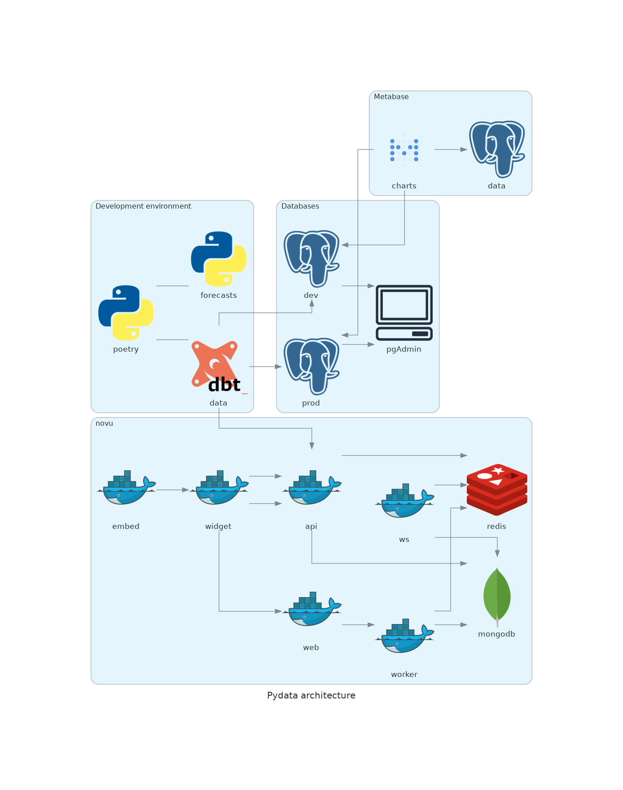
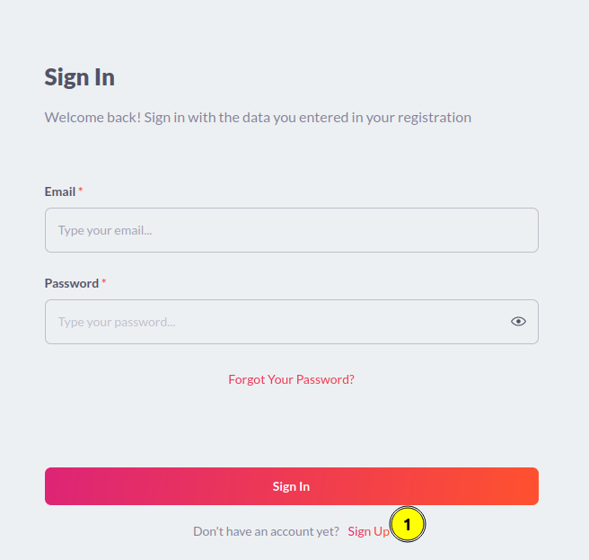
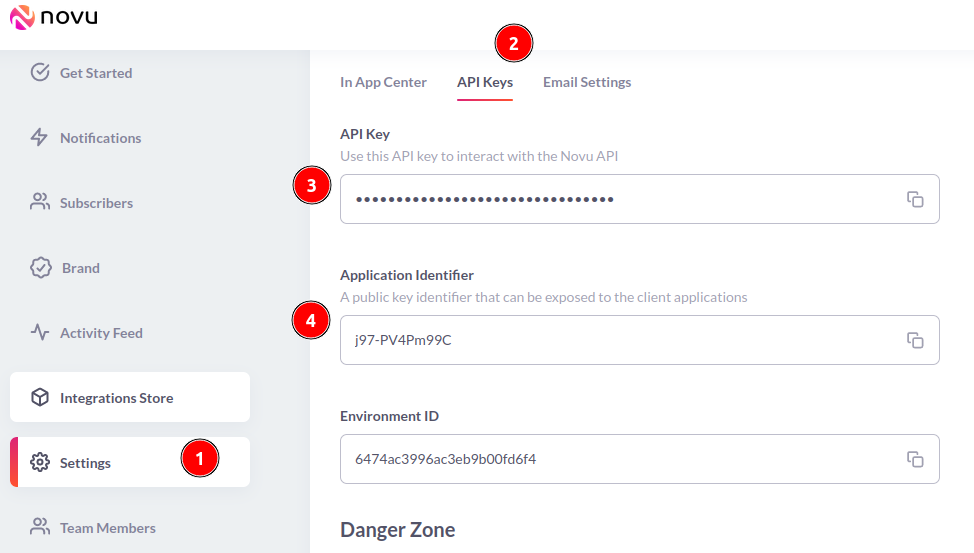
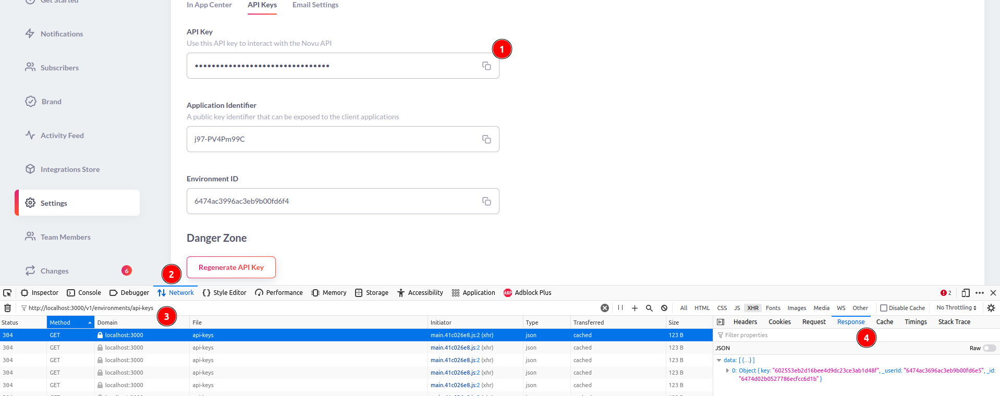

# About

Example project with [dbt-fal](https://github.com/fal-ai/fal)



## Requirements

### docker

- docker 24.0.1
- docker-compose v2.18.1

Read more about it at <https://docs.docker.com/engine/install/ubuntu/#set-up-the-repository>

### devcontainer CLI (optional)

- devcontainer 0.4.0

Read more about it <https://code.visualstudio.com/docs/devcontainers/devcontainer-cli>.

## Quickstart

- Install `docker` and `docker compose`
- Clone this repository
- Copy `example.env` to `.env` and fill in the following values needed
  - `JWT_SECRET` can be generated with `openssl rand -base64 32`
  - `STORE_ENCRYPTION_KEY` can be generated with `openssl rand -base64 32`. **It must be 32 characters long**.
  <!-- trunk-ignore(markdownlint/MD013) -->
- Install [VSCode](https://code.visualstudio.com/) and the [Remote - Containers](https://marketplace.visualstudio.com/items?itemName=ms-vscode-remote.remote-containers) extension.
<!-- trunk-ignore(markdownlint/MD013) -->
- `docker compose up -d` and wait until the containers are up and running.
- If you have the devcontainer CLI installed, run `devcontainer open` to open the project in a container.
- Alternatively, open the project in VSCode and click on the green icon in the bottom left corner to open the project in a container.
- Set up your novu keys at `.env` and restart the `dev_env` container with `docker compose up -d dev_env`. Read more about how to fetch your novu keys below.
- Run `make demo.forecast` to run the demo forecast.

## Passwords

Passwords are hardcoded. Check the docker-compose files used for each service.

## Setting up novu

### Create an account

Credentials are only for the local deployment. Use something like `pydata@yopmail.com:Pydata2023!`.



### create a basic application


The template used in the demo is

```text
Forecast Finished! Results: y_mean_hat = {{results.yhat_mean}}
```

#### testing your notification


### Fetch novu credentials

1. At development level, these are passed in as environment variables through docker compose
2. You can set them with export `NOVU_API_KEY=your_api_key` and `export NOVU_SUBSCRIBER_ID=your_api_id`

   1. `NOVU_SUBSCRIBER_ID` is the id of the client receiving the notification

      

   2. `API Key` can be retrieved from settings

      

3. Getting the token is tricky. Copy button won't work on http. See [https://discordapp.com/channels/895029566685462578/1081079551179890709](https://discordapp.com/channels/895029566685462578/1081079551179890709)

4. alternatively, read it using the developer tools in your browser. It is the response to <http://localhost:3000/v1/environment/api_keys>.

    

5. Update these keys at your `.env`

    ```ini
    # needed to connect to novu
    NOVU_API_KEY=fetch-me-from-novu
    NOVU_SUBSCRIBER_ID=fetch-me-from-novu
    NOVU_APP_NAME=pydata-demo-1
    ```

6. Restart the `dev_env` container with `docker compose up -d dev_env`